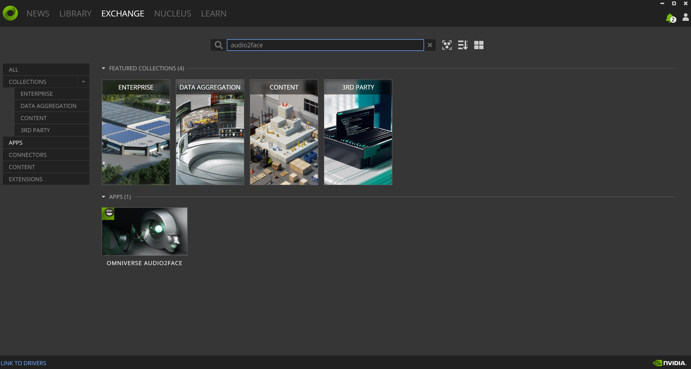
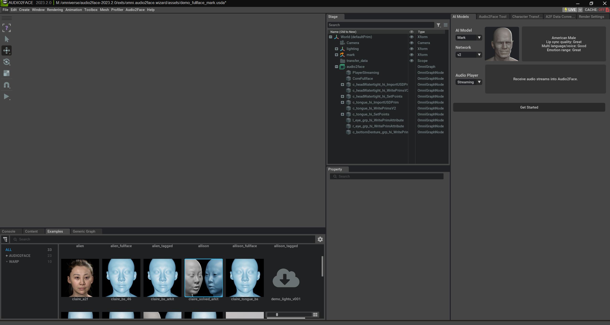
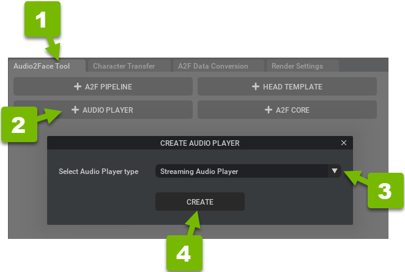
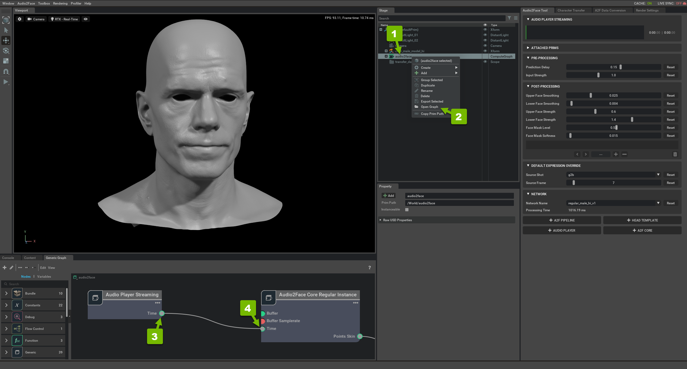
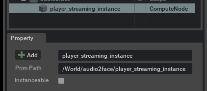

# Omniverse and Audio2Face Setup Guide

**NVIDIA Omniverse** is a powerful, multi-GPU, real-time simulation and collaboration platform that transforms workflows for design, animation, and simulation. Omniverse aims to empower creators, designers, and engineers to collaboratively build virtual worlds that were not previously possible. The platform is built on USD (Universal Scene Description), which allows for seamless and consistent sharing of data and workflows across multiple applications and users.

**Audio2Face** is an application within the Omniverse ecosystem that simplifies the process of animating a 3D character's face by using just an audio track. This technology uses deep learning to automatically generate expressive facial animations that are synchronized with the voice, making it a valuable tool for creators in animation and game development.

## System Requirements

### Hardware Requirements
- **GPU**: NVIDIA RTX 2060 or better (RTX 30/40 series recommended)
- **RAM**: Minimum 16GB, recommended 32GB
- **Storage**: 20GB free space for Omniverse and Audio2Face
- **CPU**: Intel i7-8700K / AMD Ryzen 7 2700X or better

### Software Requirements
- **OS**: Windows 10/11 (64-bit) or Linux Ubuntu 20.04+
- **Graphics Driver**: NVIDIA Studio Driver 452.06 or newer
- **Internet**: Stable connection for downloads and updates

## Step-by-Step Guide

### Step 1: Install NVIDIA Omniverse Launcher

#### 1.1 Download Omniverse Launcher
1. Go to [NVIDIA Omniverse](https://www.nvidia.com/omniverse/download/)
2. Click "Download Omniverse"
3. Fill out the registration form (requires NVIDIA Developer account)
4. Download the installer for your operating system

#### 1.2 Install Omniverse Launcher
**On Windows:**
1. Run the downloaded installer (`OmniverseLauncher.exe`)
2. Follow the installation wizard
3. Choose installation directory (default recommended)
4. Wait for installation to complete (may take 5-10 minutes)
5. Launch Omniverse Launcher when installation finishes

**On Linux:**
1. Make the AppImage executable: `chmod +x omniverse-launcher-linux.AppImage`
2. Run the AppImage: `./omniverse-launcher-linux.AppImage`
3. Follow the setup wizard

#### 1.3 Initial Setup
1. **Sign In**: Use your NVIDIA Developer account credentials
2. **Accept License**: Read and accept the Omniverse License Agreement
3. **Complete Setup**: Finish the initial configuration wizard

### Step 2: Install Audio2Face Application

#### 2.1 Access Omniverse Exchange
1. In Omniverse Launcher, click the **"EXCHANGE"** tab at the top
2. This opens the Omniverse Exchange marketplace

#### 2.2 Find and Install Audio2Face
1. In the search bar, type **"Audio2Face"**
2. Click on the **Audio2Face** application tile
   
3. Click **"Download"** button
4. The download will begin (approximately 2-3GB)
5. Monitor progress in the Downloads section
6. Installation will begin automatically after download completes

#### 2.3 Verify Installation
1. Once installed, go to the **"APPS"** tab in Omniverse Launcher
2. You should see Audio2Face listed with a **"Launch"** button
3. **Important**: Do not launch yet - we need to configure it first

### Step 3: Set Up Audio2Face Project

#### 3.1 Launch Audio2Face for First Time
1. In Omniverse Launcher, go to **APPS** tab
2. Click **"Launch"** next to Audio2Face
3. **First launch takes longer** (2-5 minutes) as it initializes
4. Wait for the Audio2Face interface to fully load

#### 3.2 Load Sample Project
1. In Audio2Face main window, look for **File** menu
2. Click **"Open"** or look for recent projects
3. Navigate to sample scenes (usually in Documents/Omniverse/Audio2Face/samples/)
4. Select **`solved_arkit.usd`** or similar ARKit-compatible sample
   
5. Click **"Open"** to load the scene
6. Wait for the scene to load completely (you should see a 3D character face)

#### 3.3 Understanding the Interface
- **Viewport**: Shows the 3D character face
- **Audio2Face Tool Panel**: Control panel on the left/right
- **Graph View**: Shows the node connections (accessible via Graph tab)
- **Properties Panel**: Shows settings for selected objects

### Step 4: Configure Streaming Audio Player

#### 4.1 Create Streaming Audio Player
1. In the Audio2Face interface, locate the **"Audio2Face" tool panel**
2. Scroll down to find the **"Audio Player"** section
   
3. Click the **"+"** button next to **"Audio Player"**
4. From the dropdown menu, select **"Streaming Audio Player"**
5. A new streaming player instance will be created in the scene

#### 4.2 Connect Audio Player in Graph View
1. At the bottom of the interface, click the **"Graph"** tab
2. You'll see the Audio2Face processing graph with various nodes
   
3. **Important Connection**: Find the newly created **"player_streaming_instance"** node
4. Connect the **"time"** output from player_streaming_instance to the **"time"** input of **"Audio2Face Core"** node
5. **How to connect**:
   - Click and drag from the small dot on the right side of player_streaming_instance
   - Drag to the small dot on the left side of Audio2Face Core
   - You should see a connection line appear

#### 4.3 Configure Streaming Player Settings
1. Click on the **"player_streaming_instance"** node in the graph
2. In the **Properties panel**, configure the following:
   - **Auto Play**: Enable this option
   - **Loop**: Disable for real-time streaming
   - **Sample Rate**: Set to 22050 Hz (to match RIVA TTS output)

#### 4.4 Note the Prim Path (Critical for Integration)
1. In the stage hierarchy (left panel), find and click **"player_streaming_instance"**
2. In the **Property panel**, locate the **"Prim Path"** field
   
3. **Copy this path exactly** (typically `/World/audio2face/PlayerStreaming`)
4. **Save this path** - you'll need it for LLMAvatarTalk configuration

### Step 5: Test Audio2Face Functionality

#### 5.1 Locate Test Script
The Audio2Face installation includes a test client script:

**Typical Locations:**
- **Windows**: `C:\Users\[Username]\AppData\Local\ov\pkg\audio2face-[version]\exts\omni.audio2face.player\omni\audio2face\player\scripts\streaming_server\test_client.py`
- **Linux**: `~/.local/share/ov/pkg/audio2face-[version]/exts/omni.audio2face.player/omni/audio2face/player/scripts/streaming_server/test_client.py`

#### 5.2 Find Your Audio2Face Installation Path
1. In Omniverse Launcher, go to **APPS** tab
2. Right-click on Audio2Face
3. Select **"Show in Explorer"** (Windows) or **"Show in Files"** (Linux)
4. Navigate to the test script location

#### 5.3 Prepare Test Audio
1. Create a simple WAV file or use any speech audio file
2. Ensure it's in WAV format, mono channel, 22050 Hz sample rate
3. Save it as `test_audio.wav`

#### 5.4 Run Test Script
```bash
# Navigate to the test script directory
cd "[Audio2Face-Installation-Path]/exts/omni.audio2face.player/omni/audio2face/player/scripts/streaming_server/"

# Run the test (replace with your actual prim path)
python test_client.py test_audio.wav /World/audio2face/PlayerStreaming
```

#### 5.5 Verify Test Results
1. The script should connect to Audio2Face
2. You should see the character's face animate based on the audio
3. Console output should show successful connection and streaming

### Step 6: Configure for LLMAvatarTalk Integration

#### 6.1 Enable gRPC Server
1. In Audio2Face, go to **Window** → **Extensions**
2. Search for **"Streaming"** or **"gRPC"**
3. Ensure **"omni.audio2face.player"** extension is enabled
4. This enables the gRPC server for external connections

#### 6.2 Note Connection Settings
The default gRPC server settings are:
- **Host**: `localhost`
- **Port**: `50051` (Audio2Face gRPC port)
- **Prim Path**: Your noted path from Step 4.4

#### 6.3 Verify gRPC Server is Running
```python
# Test connection with Python
import grpc

# Create a channel to Audio2Face gRPC server
channel = grpc.insecure_channel('localhost:50051')

# If no exception is raised, the server is accessible
print("Audio2Face gRPC server is accessible")
```

### Step 7: Configure Live Link for Unreal Engine (Optional)

#### 7.1 Enable Live Link Plugin
1. In Audio2Face, go to **Window** → **Extensions**
2. Search for **"Live Link"**
3. Enable **"omni.audio2face.livelink.core"** extension

#### 7.2 Configure Live Link Settings
1. Go to **Window** → **Live Link**
2. Configure connection settings:
   - **Port**: `12030` (default Live Link port)
   - **Audio Port**: `12031`
   - **Enable Face Capture**: Check this option

#### 7.3 Test Live Link Connection
1. Start Unreal Engine (if you have it set up)
2. In UE, open Live Link window
3. Add Audio2Face source
4. You should see face blendshape data streaming

### Troubleshooting

#### Common Issues and Solutions

**1. Audio2Face Won't Launch**
- Check GPU drivers are up to date
- Ensure you have sufficient GPU memory (4GB+ recommended)
- Try launching as administrator (Windows)

**2. Sample Project Won't Load**
- Check file paths for special characters or spaces
- Try loading a different sample project
- Restart Audio2Face and try again

**3. Streaming Player Not Appearing**
- Make sure you selected "Streaming Audio Player" not regular "Audio Player"
- Check the Audio2Face tool panel is expanded
- Try refreshing the interface (F5)

**4. Graph Connections Fail**
- Ensure you're connecting the correct nodes
- Check that both nodes have visible connection points
- Try zooming in on the graph for better precision

**5. Test Script Fails**
```bash
# Common fixes:
# Check Python environment
python --version

# Install required packages
pip install grpcio numpy soundfile

# Verify file paths and permissions
ls -la test_audio.wav
ls -la test_client.py
```

**6. gRPC Connection Issues**
- Check Windows Firewall settings
- Verify port 50051 is not blocked
- Ensure Audio2Face is running when testing connection

### Performance Optimization

#### For Better Performance:
1. **GPU Memory**: Monitor GPU usage with `nvidia-smi`
2. **Quality Settings**: Reduce viewport quality if needed
3. **Background Apps**: Close unnecessary applications
4. **Sample Rate**: Match sample rates across all components (22050 Hz recommended)

#### Optimal Settings for LLMAvatarTalk:
- **Sample Rate**: 22050 Hz
- **Channels**: Mono
- **Format**: 32-bit float for best quality
- **Latency**: Minimize by using direct gRPC streaming

Your Audio2Face setup is now complete and ready for integration with LLMAvatarTalk!

### Next Steps

1. **Continue to Unreal Engine Setup**: [UE Tutorial](../UE/UE_Tutorial.md)
2. **Test Integration**: Use the complete setup guide
3. **Optimize Performance**: Adjust settings based on your hardware

Remember to keep Audio2Face running when using LLMAvatarTalk, as it needs to receive the audio stream for facial animation.