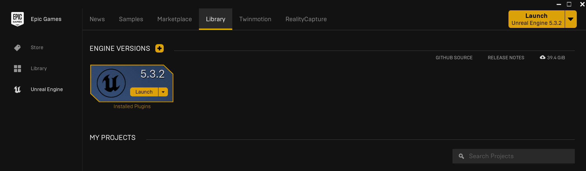
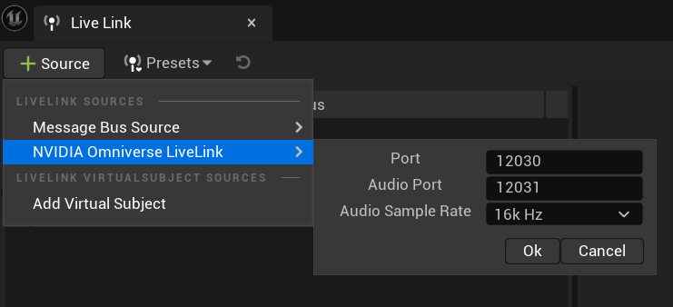
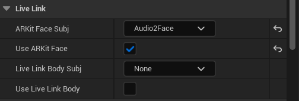

# Unreal Engine and MetaHuman Setup Guide

**Unreal Engine (UE)** is a powerful game engine developed by Epic Games, widely used for creating high-quality games, simulations, and visualizations. It offers advanced real-time 3D creation tools, a robust rendering engine, and an extensive suite of features for developers, making it a popular choice in the gaming and entertainment industry.

**MetaHuman** is a groundbreaking tool within Unreal Engine that allows for the creation of highly realistic human characters. Developed by Epic Games, MetaHuman Creator enables users to design and customize digital humans with ease, offering a wide range of facial features, skin tones, hairstyles, and more. This tool significantly reduces the time and effort required to create lifelike characters for games, films, and other interactive applications.

## System Requirements

### Hardware Requirements
- **CPU**: Intel i7-8700K / AMD Ryzen 7 2700X or better
- **GPU**: NVIDIA RTX 3060 / RTX A4000 or better (minimum 8GB VRAM)
- **RAM**: 32GB DDR4 (recommended 64GB for optimal performance)
- **Storage**: 100GB free SSD space for UE + MetaHuman assets

### Software Requirements
- **OS**: Windows 10/11 (64-bit) - Primary platform
- **Visual Studio**: 2019 or 2022 with C++ development tools
- **Epic Games Account**: Required for downloads and MetaHuman Creator

**Important Version Note**: This guide uses **Unreal Engine 5.3.x** specifically, as the Audio2Face plugins currently support UE 5.3 but not newer versions.

## Step-by-Step Guide

### Step 1: Install Epic Games Launcher

#### 1.1 Download Epic Games Launcher
1. Go to [Epic Games Store](https://www.epicgames.com/store/)
2. Click **"Get Epic Games"** in the top-right corner
3. Click **"Download Launcher"**
4. Save the installer to your Downloads folder

#### 1.2 Install Epic Games Launcher
1. Run **EpicInstaller.msi** (Windows) as Administrator
2. Follow the installation wizard
3. Choose installation location (default is fine)
4. Wait for installation to complete
5. Launch Epic Games Launcher

#### 1.3 Create/Sign In to Epic Games Account
1. If you have an account, click **"Sign In"**
2. If new user, click **"Sign In"** → **"Sign Up"**
3. Complete account creation and email verification
4. Accept the Epic Games Store Terms of Service

### Step 2: Install Unreal Engine 5.3

#### 2.1 Access Unreal Engine
1. In Epic Games Launcher, click **"Unreal Engine"** tab
2. Click **"Library"** in the left sidebar
3. You'll see the Engine Versions section

#### 2.2 Install Unreal Engine 5.3
1. Click the **"+"** button next to **"Engine Versions"**
2. **Critical**: Select **"5.3.x"** from the version dropdown
   - Do NOT select 5.4+ as Audio2Face plugins don't support newer versions
   
3. Choose installation options:
   - **Core Components**: Keep all checked
   - **Target Platforms**: Select your target platforms (Windows required)
   - **Additional Components**: 
     - Check "Starter Content"
     - Check "Templates and Feature Packs"
4. Choose installation location (requires ~15GB)
5. Click **"Install"**
6. Wait for download and installation (15-45 minutes depending on connection)

#### 2.3 Verify Installation
1. Once installed, you should see "UE 5.3.x" in your Engine Versions
2. Status should show "Installed"
3. Click **"Launch"** to test (optional, but recommended)

### Step 3: Create MetaHuman Character (Recommended)

#### 3.1 Access MetaHuman Creator
1. Go to [MetaHuman Creator](https://metahuman.unrealengine.com/)
2. Sign in with your Epic Games account
3. **Important**: Set the Unreal Engine version to **5.3** in your profile
   
4. Accept the MetaHuman Creator Terms

#### 3.2 Create Your Character
1. **Choose Base**: Select a base character template that closely matches your desired look
2. **Customize Face**: 
   - Adjust facial structure, features, skin tone
   - Modify eyes, nose, mouth proportions
   - Fine-tune details like wrinkles, blemishes
3. **Hair and Accessories**:
   - Choose hairstyle and color
   - Add facial hair if desired
   - Select clothing options
4. **Body Type**: Adjust overall body proportions
5. **Preview**: Test expressions and animations

#### 3.3 Export Character
1. Once satisfied with your character, click **"Create"**
2. Give your character a name (e.g., "LLMAvatar")
3. Choose **"Download for Unreal Engine"**
4. **Critical**: Select **"Unreal Engine 5.3"** as target version
5. Select quality level (High recommended)
6. Click **"Add to Queue"**
7. Download will begin (1-3GB depending on quality)

#### 3.4 Download Character Assets
1. Once processing is complete, download the character package
2. Extract to a convenient location (e.g., `Documents/MetaHumans/`)
3. Note the character name for later use

### Step 4: Set Up Unreal Engine Project

#### 4.1 Create New Project
1. Launch **Unreal Engine 5.3** from Epic Games Launcher
2. Select **"Games"** category
3. Choose **"Third Person"** template (good starting point)
4. Configure project settings:
   - **Blueprint** (not C++) - easier for beginners
   - **Starter Content**: Include
   - **Raytracing**: Enable if you have RTX GPU
5. Set project location and name: `LLMAvatarTalk_UE`
6. Click **"Create"**

#### 4.2 Initial Project Setup
1. Wait for project to load and compile shaders (5-15 minutes first time)
2. Familiarize yourself with the interface:
   - **Viewport**: 3D scene view
   - **Content Browser**: Asset management
   - **Outliner**: Scene hierarchy
   - **Details Panel**: Object properties

#### 4.3 Import MetaHuman Character
1. In the **Content Browser**, create a new folder called **"MetaHumans"**
2. **Option 1 - Direct Import**:
   - Right-click in MetaHumans folder → **"Import to..."**
   - Navigate to your downloaded MetaHuman folder
   - Select all files and import
3. **Option 2 - Copy Assets**:
   - Copy MetaHuman folder contents to `[ProjectFolder]/Content/MetaHumans/`
   - Restart Unreal Engine to refresh assets

#### 4.4 Set Up MetaHuman in Scene
1. In **Content Browser**, navigate to your MetaHuman assets
2. Find the **Blueprint** file (usually named after your character)
3. Drag the MetaHuman Blueprint into the **Viewport**
4. Position the character in the scene
5. In the **Outliner**, select your MetaHuman
6. In **Details Panel**, note the character's name and components

### Step 5: Install Audio2Face Plugin

#### 5.1 Locate Audio2Face Plugin Files
The Audio2Face UE plugins are typically located at:

**Windows**:
```
C:\Users\[Username]\AppData\Local\ov\pkg\audio2face-[version]\ue-plugins\audio2face-ue-plugins\ACEUnrealPlugin-5.3\ACE
```

**Alternative Locations**:
- Check Omniverse installation folder
- Look in Documents/Omniverse/audio2face-*/ue-plugins/

#### 5.2 Install Plugin to Project
1. Navigate to your Unreal Engine project folder:
   ```
   [ProjectPath]/LLMAvatarTalk_UE/
   ```
2. Create a **"Plugins"** folder if it doesn't exist
3. Copy the entire **"ACE"** folder to the Plugins directory:
   ```
   [ProjectPath]/LLMAvatarTalk_UE/Plugins/ACE/
   ```
4. The final structure should be:
   ```
   LLMAvatarTalk_UE/
   ├── Plugins/
   │   └── ACE/
   │       ├── ACE.uplugin
   │       ├── Source/
   │       └── [other plugin files]
   ```

#### 5.3 Enable Plugin in Unreal Engine
1. **Restart Unreal Engine** completely
2. Open your project
3. Go to **Edit** → **Plugins**
4. In the Plugins window, search for **"Audio2Face"** or **"ACE"**
5. Check the box to **Enable** the Audio2Face plugin
6. Click **"Restart Now"** when prompted
7. Wait for project to reload

#### 5.4 Verify Plugin Installation
1. In the **Edit** menu, you should see new Audio2Face options
2. The **Content Browser** should show Audio2Face plugin content
3. Check **Window** → **Developer Tools** for Audio2Face tools

### Step 6: Configure Live Link for Audio2Face

#### 6.1 Open Live Link
1. In Unreal Engine, go to **Window** → **Virtual Production** → **Live Link**
   
2. The Live Link window will open (can be docked anywhere)

#### 6.2 Add Audio2Face Source
1. In Live Link window, click the **"Source"** dropdown (+ icon)
2. Select **"Audio2Face LiveLink"** from the list
3. If you don't see this option, verify the plugin is installed correctly

#### 6.3 Configure Connection Settings
1. In the connection dialog, configure:
   - **Server IP**: `localhost` (if Audio2Face is on same machine)
   - **Port**: `12030` (default Live Link port)
   - **Audio Port**: `12031` 
   - **Audio Sample Rate**: `22050` Hz (to match Audio2Face and RIVA)
   
2. Click **"Ok"** to establish connection

#### 6.4 Configure Live Link Subject
1. In Live Link window, you should see **"Audio2Face"** subject appear
2. Select the Audio2Face subject
3. **Important**: Check **"Use ARKit Face"** option
   
4. The status indicator should show **"Connected"** (green)

### Step 7: Apply Live Link to MetaHuman

#### 7.1 Select MetaHuman in Scene
1. In the **Outliner**, click on your MetaHuman character
2. In the **Details Panel**, look for the **"Face"** component
3. Expand the face component properties

#### 7.2 Configure Face Animation
1. In MetaHuman face component, find **"Animation"** settings
2. Look for **"Live Link Subject"** or **"Animation Blueprint"**
3. Set the Live Link Subject to **"Audio2Face"**
4. Ensure **"ARKit Face"** is selected as the animation source

#### 7.3 Test Live Link Connection
1. Make sure Audio2Face is running with streaming player configured
2. In Audio2Face, play some test audio
3. In Unreal Engine Live Link window, you should see:
   - **Data incoming** indicators
   - **Blendshape values** updating in real-time
4. The MetaHuman's face should animate based on the audio

### Step 8: Optimize Performance and Quality

#### 8.1 Rendering Quality Settings
1. Go to **Edit** → **Project Settings**
2. Navigate to **Engine** → **Rendering**
3. Adjust settings based on your hardware:
   - **Anti-Aliasing**: TAA (good balance)
   - **Post Processing**: Medium to High
   - **Shadows**: Medium (adjust based on GPU)

#### 8.2 MetaHuman Quality Settings
1. Select your MetaHuman in the scene
2. In **Details Panel**, adjust **LOD** (Level of Detail) settings
3. For real-time performance:
   - **LOD 0**: High quality for close-ups
   - **LOD 1-2**: Reduced quality for optimization

#### 8.3 Live Link Performance
1. In Live Link settings, adjust **"Update Rate"**
2. For real-time conversation: 30-60 FPS
3. Monitor performance with **Stat FPS** console command

### Step 9: Test Complete Pipeline

#### 9.1 Prepare for Testing
1. **Audio2Face**: Running with streaming player configured
2. **Unreal Engine**: MetaHuman loaded with Live Link connected
3. **RIVA**: Server running (for complete LLMAvatarTalk test)

#### 9.2 Test Live Link Data Flow
1. In Audio2Face, use the test client script to send audio
2. Monitor Live Link window for data flow
3. Observe MetaHuman facial animation in real-time
4. Verify lip sync accuracy and expression quality

#### 9.3 Troubleshoot Issues
**Live Link Shows "Disconnected":**
- Check Audio2Face Live Link plugin is enabled
- Verify IP address and port settings
- Restart both applications

**No Facial Animation:**
- Ensure MetaHuman face component is configured correctly
- Check ARKit Face option is enabled
- Verify Live Link subject assignment

**Poor Performance:**
- Reduce rendering quality settings
- Lower MetaHuman LOD settings
- Close unnecessary applications

### Advanced Configuration

#### Custom Animation Blueprints
1. Create custom Animation Blueprint for more control
2. Add Live Link nodes for Audio2Face data
3. Customize facial expression mapping

#### Multiple Characters
1. Add multiple MetaHuman characters to scene
2. Configure individual Live Link subjects
3. Use different Audio2Face instances or channels

#### Scene Lighting and Cameras
1. Set up appropriate lighting for your MetaHuman
2. Configure cameras for optimal viewing angles
3. Add environment and background elements

### Next Steps

1. **Complete Integration**: Use the main setup guide to connect all components
2. **Test LLMAvatarTalk**: Run the complete pipeline with speech recognition
3. **Customize**: Adjust character appearance and scene setup
4. **Optimize**: Fine-tune performance based on your hardware

Your Unreal Engine and MetaHuman setup is now complete and ready for integration with the LLMAvatarTalk system!

### Troubleshooting Reference

#### Common Issues
- **Plugin not appearing**: Check UE version compatibility (must be 5.3.x)
- **Connection timeout**: Verify firewall settings and port availability
- **Poor animation quality**: Check sample rate matching across all components
- **Performance issues**: Monitor GPU/CPU usage and adjust quality settings

#### Log Files
- **UE Logs**: `[ProjectFolder]/Saved/Logs/`
- **Plugin Logs**: Check Output Log window in UE Editor
- **Live Link Status**: Monitor Live Link window for connection status

The integration between Unreal Engine, MetaHuman, and Audio2Face provides the visual foundation for the LLMAvatarTalk interactive AI assistant.